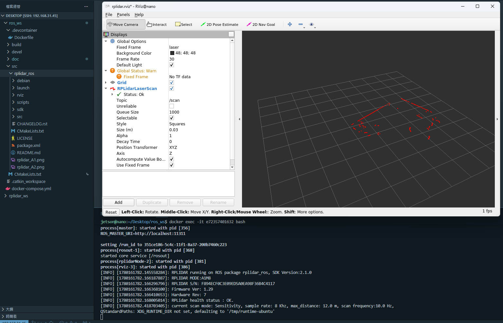

# W14

### 開發環境架設
在 [Jetson nano Ubuntu 20][def-ub20] 上使用 docker 架 [ros-noetic][def-ros] 環境


[def-ub20]: https://github.com/Qengineering/Jetson-Nano-Ubuntu-20-image
[def-ros]: https://hub.docker.com/r/arm64v8/ros/

### Github 管理程式
LINK：https://github.com/willywillywill/Modular_robots/

把 ros 工作空間和 dockerfile、docker-compose.yam上傳到github中


### LiDar 測試

在 docker 環境中使用 [`rplidar_ros`][def-rplidar_ros] 的文件測試雷達在rviz顯示
```
roslaunch rplidar_ros view_rplidar_a1.launch
```

[def-rplidar_ros]: https://github.com/Slamtec/rplidar_ros